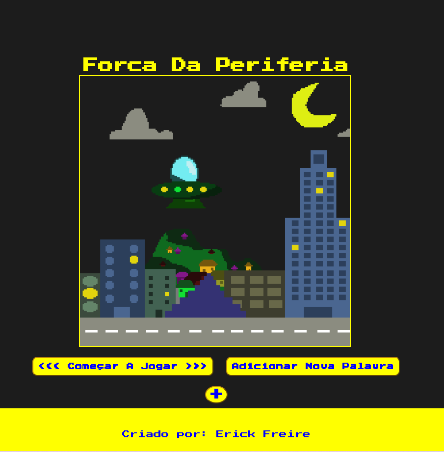
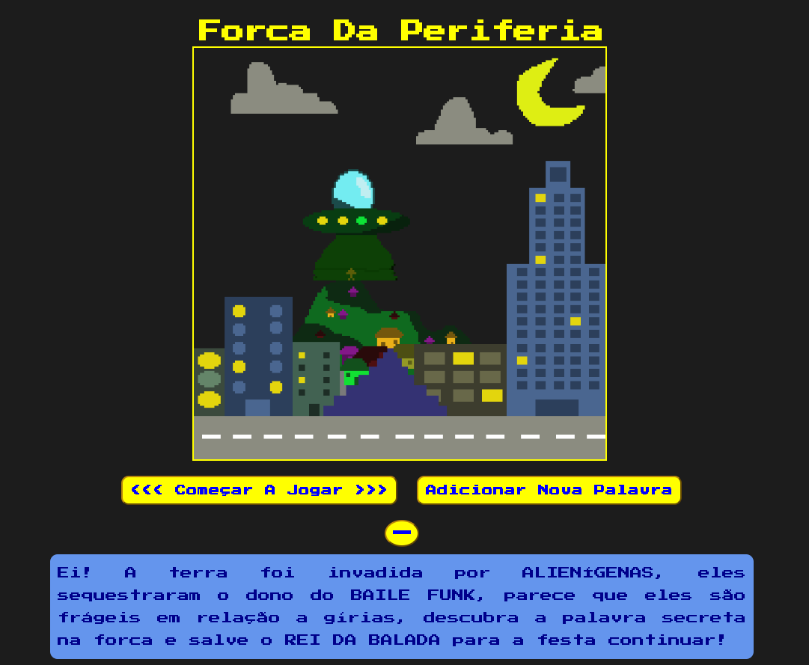
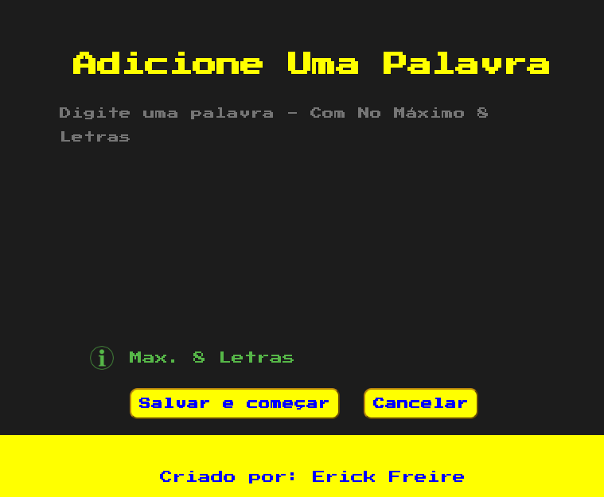
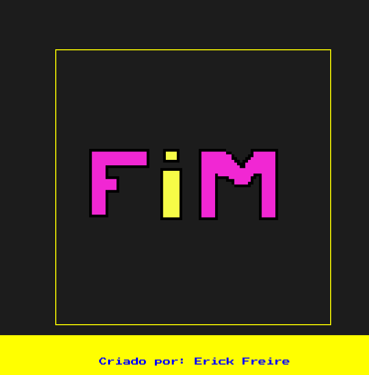
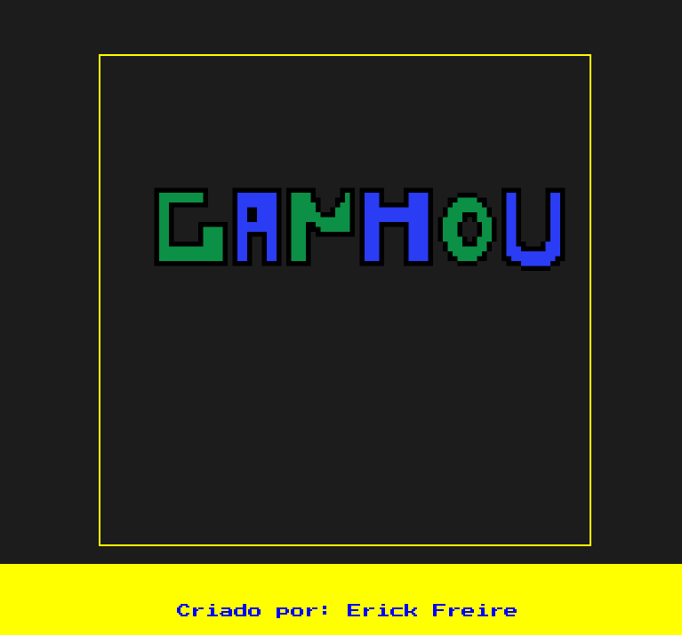

# Forca_Da_Periferia
 Jogo da Forca - Feito com Gírias - Tecnologias HTML, CSS e Javascript

 - Pode usar as palavras já previamente cadastradas
 - Pode cadastrar novas palavras
 - Pode Ganhar o game
 - Pode Perder o game
 - Pode Cancelar uma partida
 - Pode gerar nova palavra aleatória

 ## Página Inicial do Aplicativo

 ## História do game

 ## Página Para Adicionar Nova Palavra

 ## Página Com Letras Erradas

 ## Página Final - Perdeu

 ## Página Final - Ganhou

